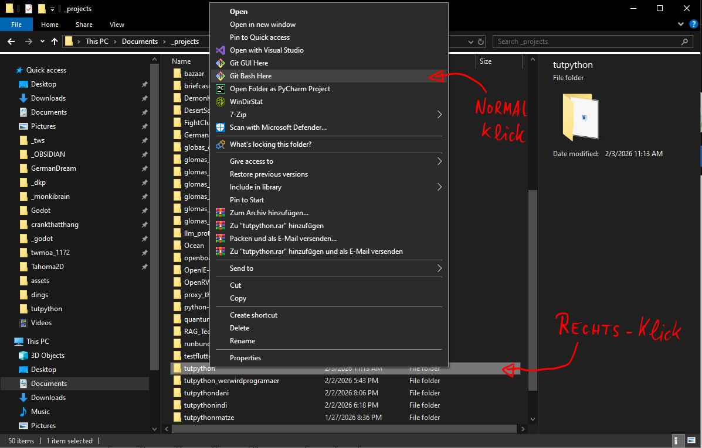
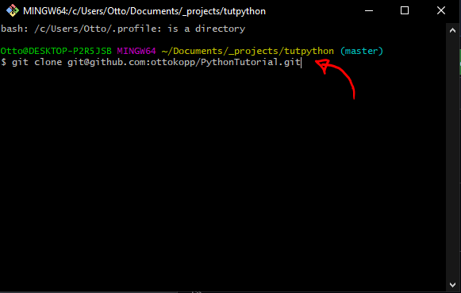

# Allgemein

1. Die Hausaufgaben sind grundsätzlich freiwillig (der ganze Kurs ist grundsätzlich freiwillig, aber die Hausi ist nochmal freiwilliger :))
2. Du solltest maximal 15-30 Minuten daran verbringen. Es macht keinen Sinn, seinen Kopf stundenlang gegen die Wand zu schlagen, wenn man nicht weiterkommt.

# Herangehensweise

1. Benutze grundsätzlich immer git und venv für alles, das muss dir in Fleisch und Blut übergehen.

Wenn du die "PythonTutorial"-Repository von git noch nicht auf deinen Rechner geklont hast, dann such dir einen freien, **leeren** Ordner aus (oder mach einen neuen, kannst ihn nennen, wie du willst), wo die rein soll. 
Rechtsklick diesen Ordner, drücke auf "Git bash" (siehe Bild) und in dem erscheinenden Terminal, gib folgenden Befehl ein:
```
git clone git@github.com:ottokopp/PythonTutorial.git
```

Wenn du die Repo schonmal geklont hast und schon auf deinem Rechner hast, kannst du wie oben mit Rechtklick auf den Ordner -> "Git bash" das Terminal für den Ordner öffnen und musst nur die aktuellste Version runterziehen. Das machst du, in dem du auf die Haupt-"Branche" wechselst und "pullst", so wie hier:
```
git checkout master
git pull
```
Dann, falls du noch keinen ".venv" Ordner in deinem Projekt hast, erstelle einen mit (das geht in jedem Terminal, das im richtigen Ordner geöffnet ist. Kannst du in Git Bash machen, wo du gerade git pull ausgeführt hast. Oder später im VsCode Terminal.)
```
python -m venv .venv
```